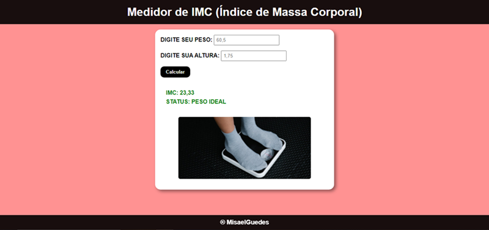

    

## 🖥️ Projeto
Este é um site simples desenvolvido para calcular o IMC (Índice de Massa Corporal). O IMC é uma medida amplamente utilizada para avaliar se uma pessoa possui um peso saudável em relação à sua altura.

## Como Usar
Basta preencher os campos com a sua altura e peso e clicar no botão "Calcular". O site irá processar as informações fornecidas e exibirá o valor do seu IMC juntamente com uma classificação que indica em qual faixa de peso você se encontra.

## Interpretação do IMC
O IMC pode ser interpretado de acordo com as seguintes faixas de peso:

- Abaixo de 18,5: Abaixo do peso
- Entre 18,5 e 24,9: Peso normal
- Entre 25 e 29,9: Sobrepeso
- Entre 30 e 34,9: Obesidade grau 1
- Entre 35 e 39,9: Obesidade grau 2
- Acima de 40: Obesidade grau 3 (obesidade mórbida)

## Limitações do IMC
É importante lembrar que o IMC é uma medida simplificada e não leva em consideração outros fatores importantes, como a composição corporal (proporção de gordura e massa muscular) e a distribuição da gordura no corpo. Portanto, o resultado do IMC deve ser interpretado com cautela e não é um indicador definitivo da saúde de uma pessoa.

## Aviso Legal
Este site é fornecido apenas para fins informativos e não substitui a consulta a um profissional de saúde qualificado. Sempre consulte um médico ou nutricionista antes de tomar qualquer decisão relacionada à sua saúde com base nos resultados do IMC.

## 🚀 Tecnologias Utilizadas
O site foi desenvolvido utilizando as seguintes tecnologias:

- ReactJS: https://react.dev/learn